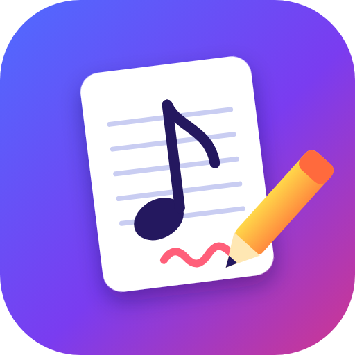

<p align="center"></p>

<h1 align="center">Partoche And Prof 1.0</h1>
<p align="center"><b>Mes partitions MuseScore sur tablette, annotées avec ma prof de violon.</b></p>

<p align="center">
<a href="https://github.com/soaresden/Partoche/releases/latest/download/Partoche.apk"><b>📱 Télécharger l'appli (APK)</b></a> ·
<a href="https://soaresden.github.io/Partoche/"><b>Page de la prof</b></a> ·
<a href="https://soaresden.github.io/Partoche/demarrer.html"><b>Démarrer (élève)</b></a> ·
<a href="https://soaresden.github.io/Partoche/guide.html"><b>Guide</b></a> (<a href="https://soaresden.github.io/Partoche/guide-en.html">EN</a> · <a href="https://soaresden.github.io/Partoche/guide-ko.html">한국어</a>)
</p>

---

## Le principe

```
🎻 Tablette de l'élève (appli Android)  ⇄  ☁️ Son dossier pCloud  ⇄  🧑‍🏫 Page web de la prof (ordi / iPad, FR · EN · 한국어)
```

- **L'élève** lit, joue et annote ses partitions sur la tablette. Tout est enregistré dans **son** pCloud (connexion directe, ou dossier de la tablette synchronisé).
- **La prof** ouvre la page web : elle lit le dossier de l'élève par un **lien de partage** (mot de passe) et y dépose ses annotations, son agenda et des partitions par un **lien de dépôt** (« Demander des fichiers »), sans compte pCloud.
- Pas de serveur Partoche And Prof : chacun écrit ses fichiers, lit ceux de l'autre. Seul un petit signal « en ligne / nouveau trait » passe par le relais public ntfy.sh (canal tiré du lien de partage).

## Le dossier pCloud de l'élève

```
Partoche/
├── MSCZ/       les partitions (.mscz), y compris celles envoyées par la prof
├── MesNotes/   un <partition>.mscz.json par partition (vue, pistes, annotations de l'élève)
├── Settings/   !Settings.json (préférences, profil, tags, étiquettes) · !Demandes.json (demandes d'avis) · !Agenda.json (cours) · !Travail.json (temps de travail) · !Log.txt
└── Prof/       envois de la prof : <Prof> - <partition>.mscz - AAAAMMJJ-HHMMSS.json · <Prof> - !Agenda - … .json
```

pCloud range chaque dépôt dans un dossier « Files from <Prof> on … » : l'appli de l'élève le vide dans `Prof/` (ou `MSCZ/` pour une partition) dès qu'il apparaît et ne garde que le dernier envoi par partition. Un ancien dossier `Eleve/` ou `ApkSettings/` est rangé automatiquement dans `MesNotes/` et `Settings/`.

## Mise en place

1. **Tablette** : installer l'APK, choisir *Élève*. L'assistant propose ☁️ *Directement dans mon pCloud* (recommandé : connexion par le site pCloud, Google et double authentification compris), 🆕 *Nouvelle installation* ou 📂 *J'ai déjà un dossier Partoche*. *Options → Refaire la configuration* pour recommencer (le logo Partoche And Prof ouvre les Options).
2. **Partage** : *Options → Partager avec mon prof* → l'appli crée (ou vérifie) le lien de partage et le lien de dépôt et prépare un message avec un **lien d'invitation**.
3. **Prof** : elle clique sur le lien d'invitation, l'élève s'ajoute tout seul (sinon *Mes élèves → Coller un code* `P1.…`). Sur iPad : Partager → Sur l'écran d'accueil. Elle garde son **code de sauvegarde** (tous ses élèves, liens et mots de passe).

## Fonctions

**Lecture** — rendu fidèle MuseScore 3 et 4 (webmscore) · curseur qui suit la musique · vitesse 25–150 % · boucle · pistes (afficher, muet, solo, volume) · noms des notes (A B C / Do Ré Mi) · **changer d'instrument** pour chaque partie (128 sons, piano main par main) · mises en page verticale, côte à côte, horizontale, **ligne continue** · zoom et défilement à deux doigts (même en mode Stylo) ou à la souris.

**Annotations** — stylo à pression, surligneur, texte, gomme, formes (⊓ tiré / V poussé, rond, carré, trait, flèche, soufflets), emojis · le calque de l'autre s'affiche dans sa couleur avec une bulle à son prénom et son emoji · « en direct » ou « modifié il y a … » : on sait qui est à jour.

**Prof ⇄ élève**
- vignettes des élèves (emoji et couleur choisis par chacun ; la prof a les siens, et l'en-tête de sa page prend sa couleur) · « X est en ligne · sur cette partition » ;
- chaque trait de la prof part tout de suite, en file d'attente, et est **relu chez l'élève** avant d'afficher « Enregistré » ; côté tablette aussi, chaque fichier écrit dans pCloud est relu ;
- la prof voit les **tags** de l'élève (Nouveau, À faire, En cours, Maîtrisé) et peut lui **envoyer des partitions** (tag *Nouveau* + fenêtre 🎁 chez l'élève) ;
- **📊 Présences** : qui est en ligne, temps de travail en **séances** (heure d'ouverture → fermeture de chaque partition, pauses de plus de 10 min non comptées), détail sur 7 jours, dernière connexion ;
- à l'ouverture de sa page, la prof voit d'abord **ce qui attend sa réponse** (demandes de cours, demandes d'avis) ;
- **📅 Agenda** : proposer, accepter, déplacer ou annuler un cours, des deux côtés (confirmé quand les deux ont accepté) · **séries** (chaque semaine / 2 semaines, un nombre de cours ou jusqu'à une date) · **disponibilités** de la prof (horaires, jours off, indisponibilités) envoyées aux élèves sous forme anonyme « Occupé » · « Prochains cours » à droite de sa liste · bandeau « cours en cours » et **à bosser** à la fin du cours (fenêtre chez l'élève, partitions en *À faire*) · « 📨 prévenir le prof » par message ;
- **💬 Demandes d'avis** : l'élève pose une question sur un morceau (`Settings/!Demandes.json`), la prof répond depuis sa page (`<Prof> - !Avis - … .json`), notification chez l'élève ;
- bouton **＋ Partitions** (LibreScore pour PC, Mac, Android).

**Et aussi** — bibliothèque (tags Nouveau / À faire / En cours / Maîtrisé + **étiquettes perso** avec emoji et couleur : 🔥 L'enfer, 😎 Easy, 🤭 Marrant, 🫠 Improbable, 💪 Déjà bossé…, filtre par étiquette, vues aussi par la prof ; tri, aperçu audio de 30 s) · accordeur multi-instruments · visite guidée · page web en français, anglais et coréen (l'appli Android est en français).

## Développement

- `web/` : l'application (HTML/JS, sans build) — `js/app.js` interface · `score.js` partitions · `audio.js` son · `ink.js` annotations · `pcloud.js` liens publics pCloud · `i18n.js` + `i18n-dict.js` langues de la page web · `tuner.js` accordeur · `tuto.js` visite guidée. `version.js` est généré.
- `docs/` : la page web (GitHub Pages), **générée** par `tools/build-docs.sh` (copie de `web/`, version reprise de `android/app/build.gradle`) — ne pas modifier à la main.
- `android/` : coquille WebView (Java) — `MainActivity.java` (dossiers, file d'attente d'écriture avec relecture, rangement des dépôts), `PCloud.java` (API pCloud : email + mot de passe ou « digest », double authentification, ou session récupérée sur le site pCloud), `GuestCheckJob.java` (notifications : annotations, partitions, agenda). `gradle assembleRelease` embarque `web/`. La clé de signature n'est pas dans le dépôt.
- `brand/` : logo.

Tester sur PC : `python -m http.server` dans `web/`, puis http://localhost:8000.

Compiler et publier (Windows, JDK 17 + Gradle 8.11.1 + SDK Android dans `C:\Android`) : `powershell -ExecutionPolicy Bypass -File tools\build-apk.ps1 -Version 1.0.6 -Publish` (régénère `docs/`, compile l'APK signé dans `release\`, puis `tools\release.ps1`).

## Licence

GNU GPL v3 (voir [LICENSE](LICENSE)), comme webmscore, le moteur libre de MuseScore utilisé pour le rendu. Sons : FluidR3 GM (CC BY 3.0). MuseScore est une marque de ses propriétaires ; ce projet n'y est pas affilié.

<p align="center"><sub>Par Soaresden</sub></p>
